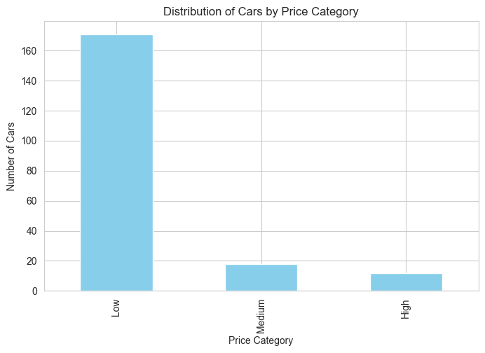
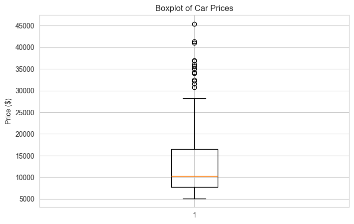
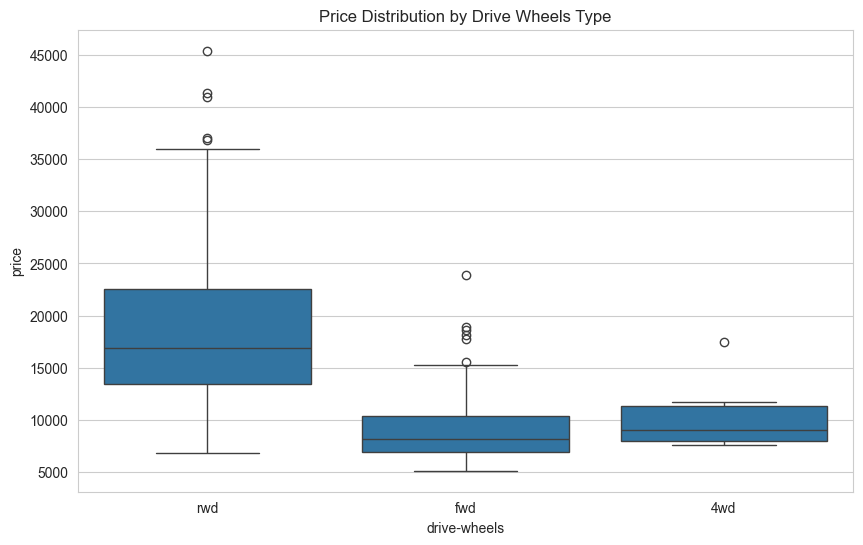
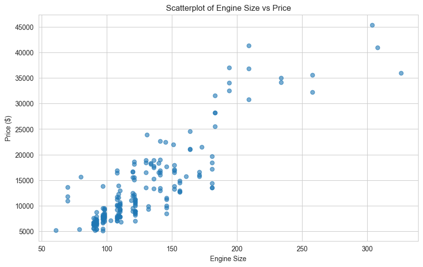
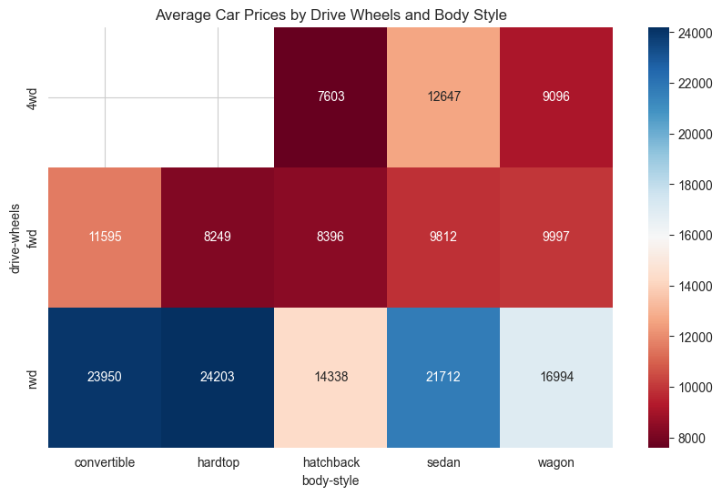
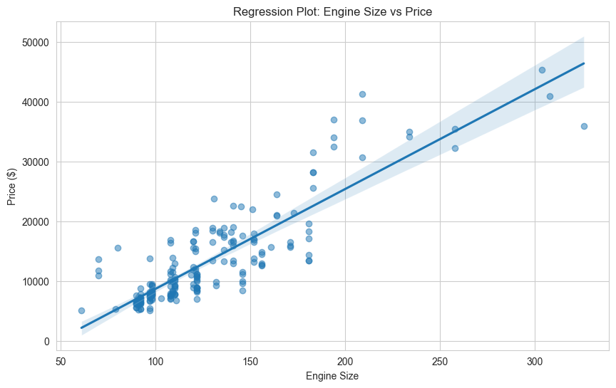

# 🚗 Analyzing Selling Price of Used Cars

## Step 1: Import Libraries

```python
import pandas as pd
import numpy as np
import matplotlib.pyplot as plt
import seaborn as sns
import scipy as sp

sns.set_style("whitegrid")
%matplotlib inline

print("Libraries imported successfully!")
```

    Libraries imported successfully!

## Step 2: Load the Dataset

```python
# Load the dataset
try:
    df = pd.read_csv('output.csv', header=None)
    print(f"Dataset loaded successfully! Shape: {df.shape}")
    print(f"Number of columns: {df.shape[1]}")
except FileNotFoundError:
    print("Error: 'output.csv' not found. Please place the file in the current directory.")
```

    Dataset loaded successfully! Shape: (205, 26)
    Number of columns: 26

## Step 3: Assign Column Headers

Your dataset has 26 columns, so we need 26 headers.

```python
# Complete list of 26 headers (matching your CSV columns)
headers = ["symboling", "normalized-losses", "make",
           "fuel-type", "aspiration", "num-of-doors",
           "body-style", "drive-wheels", "engine-location",
           "wheel-base", "length", "width", "height", "curb-weight",
           "engine-type", "num-of-cylinders", "engine-size",
           "fuel-system", "bore", "stroke", "compression-ratio",
           "horsepower", "peak-rpm", "city-mpg", "highway-mpg", "price"]

# Check if number of headers matches number of columns
print(f"Number of headers: {len(headers)}")
print(f"Number of columns in dataframe: {df.shape[1]}")

if len(headers) == df.shape[1]:
    df.columns = headers
    print("✅ Column headers assigned successfully!")
else:
    print(f"❌ Mismatch: {len(headers)} headers vs {df.shape[1]} columns")

df.head()
```

    Number of headers: 26
    Number of columns in dataframe: 26
    ✅ Column headers assigned successfully!

<div>
<style scoped>
    .dataframe tbody tr th:only-of-type {
        vertical-align: middle;
    }

    .dataframe tbody tr th {
        vertical-align: top;
    }

    .dataframe thead th {
        text-align: right;
    }

</style>
<table border="1" class="dataframe">
  <thead>
    <tr style="text-align: right;">
      <th></th>
      <th>symboling</th>
      <th>normalized-losses</th>
      <th>make</th>
      <th>fuel-type</th>
      <th>aspiration</th>
      <th>num-of-doors</th>
      <th>body-style</th>
      <th>drive-wheels</th>
      <th>engine-location</th>
      <th>wheel-base</th>
      <th>...</th>
      <th>engine-size</th>
      <th>fuel-system</th>
      <th>bore</th>
      <th>stroke</th>
      <th>compression-ratio</th>
      <th>horsepower</th>
      <th>peak-rpm</th>
      <th>city-mpg</th>
      <th>highway-mpg</th>
      <th>price</th>
    </tr>
  </thead>
  <tbody>
    <tr>
      <th>0</th>
      <td>3</td>
      <td>?</td>
      <td>alfa-romero</td>
      <td>gas</td>
      <td>std</td>
      <td>two</td>
      <td>convertible</td>
      <td>rwd</td>
      <td>front</td>
      <td>88.6</td>
      <td>...</td>
      <td>130</td>
      <td>mpfi</td>
      <td>3.47</td>
      <td>2.68</td>
      <td>9.0</td>
      <td>111</td>
      <td>5000</td>
      <td>21</td>
      <td>27</td>
      <td>13495</td>
    </tr>
    <tr>
      <th>1</th>
      <td>3</td>
      <td>?</td>
      <td>alfa-romero</td>
      <td>gas</td>
      <td>std</td>
      <td>two</td>
      <td>convertible</td>
      <td>rwd</td>
      <td>front</td>
      <td>88.6</td>
      <td>...</td>
      <td>130</td>
      <td>mpfi</td>
      <td>3.47</td>
      <td>2.68</td>
      <td>9.0</td>
      <td>111</td>
      <td>5000</td>
      <td>21</td>
      <td>27</td>
      <td>16500</td>
    </tr>
    <tr>
      <th>2</th>
      <td>1</td>
      <td>?</td>
      <td>alfa-romero</td>
      <td>gas</td>
      <td>std</td>
      <td>two</td>
      <td>hatchback</td>
      <td>rwd</td>
      <td>front</td>
      <td>94.5</td>
      <td>...</td>
      <td>152</td>
      <td>mpfi</td>
      <td>2.68</td>
      <td>3.47</td>
      <td>9.0</td>
      <td>154</td>
      <td>5000</td>
      <td>19</td>
      <td>26</td>
      <td>16500</td>
    </tr>
    <tr>
      <th>3</th>
      <td>2</td>
      <td>164</td>
      <td>audi</td>
      <td>gas</td>
      <td>std</td>
      <td>four</td>
      <td>sedan</td>
      <td>fwd</td>
      <td>front</td>
      <td>99.8</td>
      <td>...</td>
      <td>109</td>
      <td>mpfi</td>
      <td>3.19</td>
      <td>3.40</td>
      <td>10.0</td>
      <td>102</td>
      <td>5500</td>
      <td>24</td>
      <td>30</td>
      <td>13950</td>
    </tr>
    <tr>
      <th>4</th>
      <td>2</td>
      <td>164</td>
      <td>audi</td>
      <td>gas</td>
      <td>std</td>
      <td>four</td>
      <td>sedan</td>
      <td>4wd</td>
      <td>front</td>
      <td>99.4</td>
      <td>...</td>
      <td>136</td>
      <td>mpfi</td>
      <td>3.19</td>
      <td>3.40</td>
      <td>8.0</td>
      <td>115</td>
      <td>5500</td>
      <td>18</td>
      <td>22</td>
      <td>17450</td>
    </tr>
  </tbody>
</table>
<p>5 rows × 26 columns</p>
</div>

## Step 4: Check for Missing Values

```python
# Check for '?' which indicates missing data
print("Columns with '?' values:")
for col in df.columns:
    if df[col].dtype == object:
        missing_count = (df[col] == '?').sum()
        if missing_count > 0:
            print(f"- {col}: {missing_count} missing values ('?')")
```

    Columns with '?' values:
    - normalized-losses: 41 missing values ('?')
    - num-of-doors: 2 missing values ('?')
    - bore: 4 missing values ('?')
    - stroke: 4 missing values ('?')
    - horsepower: 2 missing values ('?')
    - peak-rpm: 2 missing values ('?')
    - price: 4 missing values ('?')

## Step 5: Data Cleaning

```python
# Create a copy to work on
data = df.copy()

# Convert city-mpg to L/100km (235 / mpg)
# First, convert 'city-mpg' column to numeric, coercing errors
data['city-mpg'] = pd.to_numeric(data['city-mpg'], errors='coerce')
data['city-mpg'] = 235 / data['city-mpg']
data.rename(columns={'city-mpg': 'city-L/100km'}, inplace=True)

# Check the unique values in the price column
print("Unique values in 'price' before cleaning:")
print(data['price'].unique()[:20])  # Show first 20 unique values
print(f"\nTotal rows before cleaning: {len(data)}")
```

    Unique values in 'price' before cleaning:
    ['13495' '16500' '13950' '17450' '15250' '17710' '18920' '23875' '?'
     '16430' '16925' '20970' '21105' '24565' '30760' '41315' '36880' '5151'
     '6295' '6575']

    Total rows before cleaning: 205

```python
# Remove rows where price is '?' and convert to integer
data = data[data['price'] != '?']
data['price'] = data['price'].astype(int)

print(f"Dataset shape after removing rows with missing price: {data.shape}")
print(f"Price range: ${data['price'].min()} - ${data['price'].max()}")
print(f"Average price: ${data['price'].mean():.2f}")
```

    Dataset shape after removing rows with missing price: (201, 26)
    Price range: $5118 - $45400
    Average price: $13207.13

## Step 6: Convert Numeric Columns

```python
# List of columns that should be numeric
numeric_cols = ['normalized-losses', 'bore', 'stroke', 'horsepower', 'peak-rpm']

for col in numeric_cols:
    data[col] = pd.to_numeric(data[col], errors='coerce')

print("Numeric columns converted. Check data types:")
data.dtypes
```

    Numeric columns converted. Check data types:


    symboling              int64
    normalized-losses    float64
    make                  object
    fuel-type             object
    aspiration            object
    num-of-doors          object
    body-style            object
    drive-wheels          object
    engine-location       object
    wheel-base           float64
    length               float64
    width                float64
    height               float64
    curb-weight            int64
    engine-type           object
    num-of-cylinders      object
    engine-size            int64
    fuel-system           object
    bore                 float64
    stroke               float64
    compression-ratio    float64
    horsepower           float64
    peak-rpm             float64
    city-L/100km         float64
    highway-mpg            int64
    price                  int64
    dtype: object

## Step 7: Feature Normalization and Binning

```python
# Normalize length, width, height to a 0-1 range
data['length'] = data['length'] / data['length'].max()
data['width'] = data['width'] / data['width'].max()
data['height'] = data['height'] / data['height'].max()

# Create price bins (4 bins -> 3 groups: Low, Medium, High)
bins = np.linspace(min(data['price']), max(data['price']), 4)
group_names = ['Low', 'Medium', 'High']
data['price-binned'] = pd.cut(data['price'], bins, labels=group_names, include_lowest=True)

# Visualize the bins
plt.figure(figsize=(8,5))
data['price-binned'].value_counts().plot(kind='bar', color='skyblue')
plt.title('Distribution of Cars by Price Category')
plt.xlabel('Price Category')
plt.ylabel('Number of Cars')
plt.show()

print("\nPrice categories:")
print(data['price-binned'].value_counts())
```



    Price categories:
    price-binned
    Low       171
    Medium     18
    High       12
    Name: count, dtype: int64

## Step 8: Data Visualization

```python
# Boxplot of price
plt.figure(figsize=(8,5))
plt.boxplot(data['price'])
plt.title('Boxplot of Car Prices')
plt.ylabel('Price ($)')
plt.show()
```



```python
# Boxplot of price by drive-wheels type
plt.figure(figsize=(10,6))
sns.boxplot(x='drive-wheels', y='price', data=data)
plt.title('Price Distribution by Drive Wheels Type')
plt.show()
```



```python
# Scatter plot: Engine size vs Price
plt.figure(figsize=(10,6))
plt.scatter(data['engine-size'], data['price'], alpha=0.6)
plt.title('Scatterplot of Engine Size vs Price')
plt.xlabel('Engine Size')
plt.ylabel('Price ($)')
plt.grid(True)
plt.show()
```



## Step 9: Grouping and Pivot Tables

```python
# Group by drive-wheels and body-style
test = data[['drive-wheels', 'body-style', 'price']]
data_grp = test.groupby(['drive-wheels', 'body-style'], as_index=False).mean()

print("Average price by drive-wheels and body-style:")
data_grp
```

    Average price by drive-wheels and body-style:

<div>
<style scoped>
    .dataframe tbody tr th:only-of-type {
        vertical-align: middle;
    }

    .dataframe tbody tr th {
        vertical-align: top;
    }

    .dataframe thead th {
        text-align: right;
    }

</style>
<table border="1" class="dataframe">
  <thead>
    <tr style="text-align: right;">
      <th></th>
      <th>drive-wheels</th>
      <th>body-style</th>
      <th>price</th>
    </tr>
  </thead>
  <tbody>
    <tr>
      <th>0</th>
      <td>4wd</td>
      <td>hatchback</td>
      <td>7603.000000</td>
    </tr>
    <tr>
      <th>1</th>
      <td>4wd</td>
      <td>sedan</td>
      <td>12647.333333</td>
    </tr>
    <tr>
      <th>2</th>
      <td>4wd</td>
      <td>wagon</td>
      <td>9095.750000</td>
    </tr>
    <tr>
      <th>3</th>
      <td>fwd</td>
      <td>convertible</td>
      <td>11595.000000</td>
    </tr>
    <tr>
      <th>4</th>
      <td>fwd</td>
      <td>hardtop</td>
      <td>8249.000000</td>
    </tr>
    <tr>
      <th>5</th>
      <td>fwd</td>
      <td>hatchback</td>
      <td>8396.387755</td>
    </tr>
    <tr>
      <th>6</th>
      <td>fwd</td>
      <td>sedan</td>
      <td>9811.800000</td>
    </tr>
    <tr>
      <th>7</th>
      <td>fwd</td>
      <td>wagon</td>
      <td>9997.333333</td>
    </tr>
    <tr>
      <th>8</th>
      <td>rwd</td>
      <td>convertible</td>
      <td>23949.600000</td>
    </tr>
    <tr>
      <th>9</th>
      <td>rwd</td>
      <td>hardtop</td>
      <td>24202.714286</td>
    </tr>
    <tr>
      <th>10</th>
      <td>rwd</td>
      <td>hatchback</td>
      <td>14337.777778</td>
    </tr>
    <tr>
      <th>11</th>
      <td>rwd</td>
      <td>sedan</td>
      <td>21711.833333</td>
    </tr>
    <tr>
      <th>12</th>
      <td>rwd</td>
      <td>wagon</td>
      <td>16994.222222</td>
    </tr>
  </tbody>
</table>
</div>

```python
# Create a pivot table
try:
    data_pivot = data_grp.pivot(index='drive-wheels', columns='body-style', values='price')
    print("Pivot table of average prices:")
    display(data_pivot)

    # Visualize as heatmap
    plt.figure(figsize=(10,6))
    sns.heatmap(data_pivot, annot=True, cmap='RdBu', fmt='.0f')
    plt.title('Average Car Prices by Drive Wheels and Body Style')
    plt.show()
except Exception as e:
    print(f"Could not create pivot table: {e}")
```

    Pivot table of average prices:

<div>
<style scoped>
    .dataframe tbody tr th:only-of-type {
        vertical-align: middle;
    }

    .dataframe tbody tr th {
        vertical-align: top;
    }

    .dataframe thead th {
        text-align: right;
    }

</style>
<table border="1" class="dataframe">
  <thead>
    <tr style="text-align: right;">
      <th>body-style</th>
      <th>convertible</th>
      <th>hardtop</th>
      <th>hatchback</th>
      <th>sedan</th>
      <th>wagon</th>
    </tr>
    <tr>
      <th>drive-wheels</th>
      <th></th>
      <th></th>
      <th></th>
      <th></th>
      <th></th>
    </tr>
  </thead>
  <tbody>
    <tr>
      <th>4wd</th>
      <td>NaN</td>
      <td>NaN</td>
      <td>7603.000000</td>
      <td>12647.333333</td>
      <td>9095.750000</td>
    </tr>
    <tr>
      <th>fwd</th>
      <td>11595.0</td>
      <td>8249.000000</td>
      <td>8396.387755</td>
      <td>9811.800000</td>
      <td>9997.333333</td>
    </tr>
    <tr>
      <th>rwd</th>
      <td>23949.6</td>
      <td>24202.714286</td>
      <td>14337.777778</td>
      <td>21711.833333</td>
      <td>16994.222222</td>
    </tr>
  </tbody>
</table>
</div>



## Step 10: Statistical Analysis - ANOVA Test

```python
# Alternative: Filter the dataframe directly instead of using get_group
honda_prices = data[data['make'] == 'honda']['price']
subaru_prices = data[data['make'] == 'subaru']['price']

if len(honda_prices) > 0 and len(subaru_prices) > 0:
    anova_results = sp.stats.f_oneway(honda_prices, subaru_prices)
    print("ANOVA test results (Honda vs Subaru):")
    print(f"F-statistic: {anova_results.statistic:.4f}")
    print(f"P-value: {anova_results.pvalue:.4f}")

    if anova_results.pvalue < 0.05:
        print("✅ Conclusion: There is a significant price difference between Honda and Subaru.")
    else:
        print("❌ Conclusion: No significant price difference found.")

    print(f"\nAverage Honda price: ${honda_prices.mean():.2f} (n={len(honda_prices)})")
    print(f"Average Subaru price: ${subaru_prices.mean():.2f} (n={len(subaru_prices)})")
else:
    print("Honda or Subaru data not found in dataset")
```

    ANOVA test results (Honda vs Subaru):
    F-statistic: 0.1974
    P-value: 0.6609
    ❌ Conclusion: No significant price difference found.

    Average Honda price: $8184.69 (n=13)
    Average Subaru price: $8541.25 (n=12)

```python
# Regression plot: Engine size vs Price
plt.figure(figsize=(10,6))
sns.regplot(x='engine-size', y='price', data=data, scatter_kws={'alpha':0.5})
plt.title('Regression Plot: Engine Size vs Price')
plt.xlabel('Engine Size')
plt.ylabel('Price ($)')
plt.show()
```



## Summary Statistics

```python
# Final summary
print("="*50)
print("FINAL SUMMARY")
print("="*50)
print(f"Total cars analyzed: {len(data)}")
print(f"Price range: ${data['price'].min():,} - ${data['price'].max():,}")
print(f"Average price: ${data['price'].mean():,.2f}")
print(f"Median price: ${data['price'].median():,.2f}")
print("\nTop 5 most expensive cars:")
print(data.nlargest(5, 'price')[['make', 'body-style', 'price']])
print("\nTop 5 most affordable cars:")
print(data.nsmallest(5, 'price')[['make', 'body-style', 'price']])
```

    ==================================================
    FINAL SUMMARY
    ==================================================
    Total cars analyzed: 201
    Price range: $5,118 - $45,400
    Average price: $13,207.13
    Median price: $10,295.00

    Top 5 most expensive cars:
                  make   body-style  price
    74   mercedes-benz      hardtop  45400
    16             bmw        sedan  41315
    73   mercedes-benz        sedan  40960
    128        porsche  convertible  37028
    17             bmw        sedan  36880

    Top 5 most affordable cars:
               make body-style  price
    138      subaru  hatchback   5118
    18    chevrolet  hatchback   5151
    50        mazda  hatchback   5195
    150      toyota  hatchback   5348
    76   mitsubishi  hatchback   5389

```python

```

# Used Car Selling Price Analysis

This project contains my early work in data analysis using Python. It is based on a tutorial that explores the factors influencing the selling price of used cars, aiming to provide data-driven insights for both buyers and sellers.

## Project Overview

The goal of this analysis is to understand the key attributes that affect a used car's price. By cleaning, transforming, and visualizing a dataset of car features, we can identify trends and relationships. The project follows a step-by-step approach common in data science workflows: from loading and preparing the data to performing statistical tests and creating visualizations.

## Dataset

The analysis uses a dataset containing various specifications for different car models. Key attributes include:

- **Car make and body style**
- **Engine specifications** (engine-size, horsepower, fuel-type)
- **Dimensions** (length, width, height)
- **Performance metrics** (city-mpg, highway-mpg)
- **Price** (the target variable for our analysis)

_(Note: The original tutorial uses a dataset that may need to be downloaded and potentially converted from a `.data` file to a `.csv` file before use.)_

## Steps Performed

The analysis is structured into the following logical steps, each implemented in the accompanying Python script:

1.  **Setup and Library Import**: Importing essential libraries like `pandas`, `numpy`, `matplotlib`, and `seaborn` for data manipulation and visualization.
2.  **Data Loading**: Loading the dataset into a Pandas DataFrame.
3.  **Data Preparation**:
    - Assigning descriptive column headers for clarity.
    - Checking for and handling missing values.
    - Converting data types (e.g., turning the 'price' column from string to integer).
    - Transforming features (e.g., converting fuel consumption from MPG to L/100km).
4.  **Feature Engineering**:
    - Normalizing numerical features (like length, width, height) for fair comparison.
    - Creating a new categorical feature ('price-binned') by grouping the continuous 'price' into 'Low', 'Medium', and 'High' segments.
5.  **Exploratory Data Analysis (EDA) & Visualization**:
    - Using box plots to examine the distribution of price and its relationship with 'drive-wheels'.
    - Creating scatter plots to visualize the correlation between 'engine-size' and 'price'.
    - Generating grouped summaries and pivot tables to find average prices across different categories (e.g., by drive-wheels and body-style).
    - Visualizing the pivot table data with a heatmap.
6.  **Statistical Analysis**:
    - Performing an ANOVA test to determine if there is a statistically significant difference in the mean price between cars from different makes (e.g., Honda vs. Subaru).
    - Using a regression plot (`regplot`) to further illustrate the relationship between engine size and price.

## Key Findings & Insights

The analysis helps to visually and statistically confirm several intuitions about the used car market:

- **Engine Size**: There is a strong positive correlation between engine size and selling price; larger engines typically command higher prices.
- **Drive Wheels**: The type of drive wheels (e.g., rear-wheel, front-wheel) appears to be associated with different price ranges.
- **Categorical Differences**: Statistical tests like ANOVA can reveal if the price differences between certain car brands are significant or simply due to random chance.

## Technologies Used

- **Python**: The core programming language.
- **Pandas**: For data manipulation and analysis.
- **NumPy**: For numerical operations.
- **Matplotlib & Seaborn**: For creating static and informative visualizations.
- **SciPy**: For performing statistical tests like ANOVA.

## How to Run This Project

1.  **Clone the repository** to your local machine.
2.  **Ensure you have the required libraries installed**. You can install them using pip:
    ```bash
    pip install pandas numpy matplotlib seaborn scipy
    ```
3.  **Prepare the dataset**: Download the dataset as indicated in the original tutorial and ensure it's in the correct path (or update the filename in the script). The script assumes a CSV file named `output.csv`.
4.  **Run the Python script** (e.g., `python analysis.py`) to execute the analysis step-by-step and generate the visualizations.

## Future Work

This project serves as a foundational analysis. Potential next steps could include:

- Building a predictive regression model to estimate a car's price based on its features.
- Exploring more advanced feature engineering and selection techniques.
- Deploying the analysis as a simple interactive web application.

---

_This project was completed as a learning exercise to understand fundamental data analysis concepts in Python._
